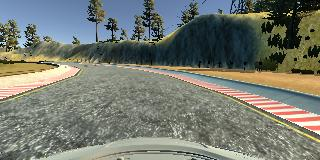
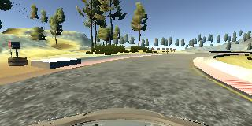
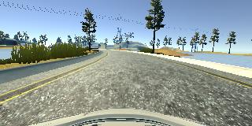
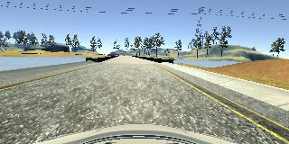

# **Behavioral Cloning** 

---

**Behavioral Cloning Project**

The goals / steps of this project are the following:

* Use the simulator to collect data of good driving behavior
* Build, a convolution neural network in Keras that predicts steering angles from images
* Train and validate the model with a training and validation set
* Test that the model successfully drives around track one without leaving the road
* Summarize the results with a written report


## Rubric Points
### Here I will consider the [rubric points](https://review.udacity.com/#!/rubrics/432/view) individually and describe how I addressed each point in my implementation.  

---
### Files Submitted & Code Quality

#### 1. Submission includes all required files and can be used to run the simulator in autonomous mode

My project includes the following files:

* `model.py` containing the script to create and train the model
* `drive.py` for driving the car in autonomous mode
* `model.h5` containing a trained convolution neural network 
* `writeup_report.md` or `writeup_report`.pdf summarizing the results
* `video.mp4` recording of autonomous driving of the 🚙.

#### 2. Submission includes functional code
Using the Udacity provided simulator and my drive.py file, the car can be driven autonomously around the track by executing 
```sh
python drive.py model.h5
```

#### 3. Submission code is usable and readable

The model.py file contains the code for training and saving the convolution neural network. The file shows the pipeline I used for training and validating the model, and it contains comments to explain how the code works.

### Model Architecture and Training Strategy

#### 1. An appropriate model architecture has been employed
My final model consisted of following layers:


My final model consisted of the following layers:

| Layer         		|     Description	        					| 
|:---------------------:|:---------------------------------------------:| 
| Input         		| 160x320x3 RGB image   
| Cropping         		| Cropping 70 from top and 20 from bottom, Output = 70x320x3  							| 
| Convolution 5x5     	| 2x2 stride, relu activation, valid padding,  Output = 32x163x24 
| Dropout     	| p=0.2,  Output = 32x163x24 
| Convolution 5x5     	| 2x2 stride, relu activation, valid padding,  Output = 14x80x36 
| Dropout     	| p=0.2,  Output = 14x80x36 
| Convolution 5x5     	| 2x2 stride, relu activation, valid padding,  Output = 5x38x48 
| Dropout     	| p=0.2,  Output = 5x38x48
| Convolution 3x3     	| 1x1 stride, relu activation, valid padding,  Output = 3x36x64 
| Dropout     	| p=0.2,  Output = 3x36x64  
| Convolution 3x3     	| 1x1 stride, relu activation, valid padding,  Output = 1x34x64 
| Flatten     	| Output = 3x36x64  	|
| Dense     	| Output = 100 	|
| Dropout     	| p=0.5,  Output = 100
| Dense     	| Output = 50 	|
| Dropout     	| p=0.3,  Output = 50
| Dense     	| Output = 10 	|
| Dense     	| Output = 1 	|   
 


#### 2. Attempts to reduce overfitting in the model

- The model contains several dropout layer
- The model was trained with data from many laps of track recording.
- The data includes several recovery instances when 🚗 is very close to track.


#### 3. Model parameter tuning

- The model used an adam optimizer, so the learning rate was not tuned manually (model.py line 107).
- The model was tested on several correction for side camera but the value of 0.2 seemed to produce better result.
- Several epochs were tried from 1 to 20 but the loss seems to increase and decrease when the epochs are more. Three epochs of training produces satisfactory result.

#### 4. Appropriate training data

- The data consist of many lap of driving.
- The data includes clockwise and counter clockwise driving.
- The data includes recovery driving when the 🚗 reaches very close to left or right lane boundary.
- The data is augmented as well.


### Model Architecture and Training Strategy

#### 1. Solution Design Approach

- First I tried using LeNet model but it did not produce great result.
- Later I tried the model developed by [Nvidia](http://images.nvidia.com/content/tegra/automotive/images/2016/solutions/pdf/end-to-end-dl-using-px.pdf) which seemed to work fine but the 🚗 went offside road after a while.
- The I started updating the model.
	- 	One obvious approach was to intoduce dropout.
	-  Later I did experiment with different number of epochs.
	-  I even tried varying the correcting angle for left and right 📸 images.
-  The model seemed fine but it did not work perfectly.
-  More data was collected and all the images (left, right and center) were flipped and a negative corresponding correction was applied.
-  To test the model, `drive.py` was run with the saved `model.h5` and the simulator was launched in autonomous mode.
-  The simulator seemed to work fine and the 🚙 did not move off the track.

#### 2. Final Model Architecture

The final model architecture (model.py lines 88-106) consisted of a convolution neural network with the following layers and layer sizes:

| Layer         		|     Description	        					| 
|:---------------------:|:---------------------------------------------:| 
| Input         		| 160x320x3 RGB image   
| Cropping         		| Cropping 70 from top and 20 from bottom, Output = 70x320x3  							| 
| Convolution 5x5     	| 2x2 stride, relu activation, valid padding,  Output = 32x163x24 
| Dropout     	| p=0.2,  Output = 32x163x24 
| Convolution 5x5     	| 2x2 stride, relu activation, valid padding,  Output = 14x80x36 
| Dropout     	| p=0.2,  Output = 14x80x36 
| Convolution 5x5     	| 2x2 stride, relu activation, valid padding,  Output = 5x38x48 
| Dropout     	| p=0.2,  Output = 5x38x48
| Convolution 3x3     	| 1x1 stride, relu activation, valid padding,  Output = 3x36x64 
| Dropout     	| p=0.2,  Output = 3x36x64  
| Convolution 3x3     	| 1x1 stride, relu activation, valid padding,  Output = 1x34x64 
| Flatten     	| Output = 3x36x64  	|
| Dense     	| Output = 100 	|
| Dropout     	| p=0.5,  Output = 100
| Dense     	| Output = 50 	|
| Dropout     	| p=0.3,  Output = 50
| Dense     	| Output = 10 	|
| Dense     	| Output = 1 	|   


#### 3. Creation of the Training Set & Training Process

- The training data was captured over multiple laps of driving.
- The center lane driving was done for more than a lap.

	
	
- A lap of clockwise and counter-clockwise driving was also done.



- To simulate recovery the car was driving very close to left and right boundary.





- The data was also augmented by flipping the images.
- The data was then shuffled before training.
- A traing and validation set was created out of shuffled data.

- Training data was used to train the model while validataion data was used to determine how well model was.
- The model did underfit, so more data was collected.
- The dropout was also introduced in the model.
- The loss was increasing after certain number of epochs. three epochs seemed to give better result.
- The value of correction was also varied to find a better value but `0.2` seemed to work fine.
- `adam` optimizer was used to optimize learning rate.

 